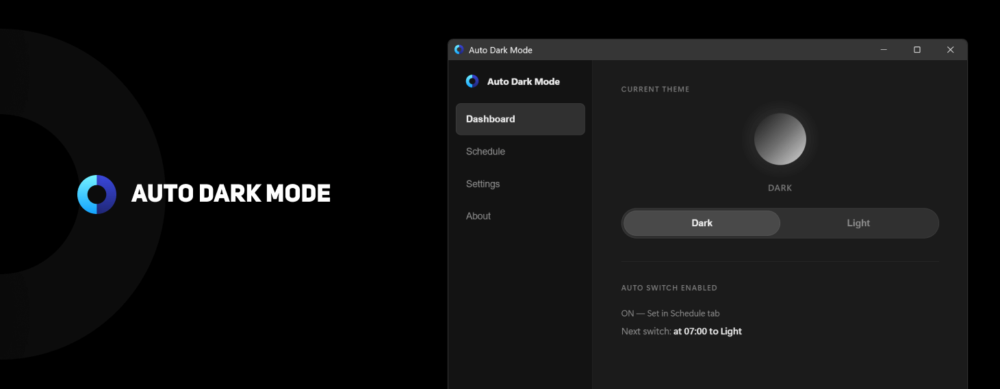

# 自动深色模式 (Auto Dark Mode)

> For English, see [README.md](README.md)

一款轻量级 Windows 应用，按**固定时间**或**日出/日落**（按地区）自动在深色与浅色模式之间切换。使用 [Tauri 2](https://v2.tauri.app/) + React 构建。

## 功能

- **计划**：固定时间（如 07:00 浅色、19:00 深色）或按经纬度日出/日落切换
- **系统主题**：切换任务栏与窗口边框
- **应用主题**：切换应用标题栏（如资源管理器、设置）
- **系统托盘**：长期静默运行于后台；关闭窗口即最小化到托盘
- **开机自启**：可选，登录时自动启动
- **语言**：中文、English

## 运行环境

- **Windows 11**（64 位）

## 隐私说明

自动深色模式**完全离线运行**，不收集、不上传、不存储任何个人数据。唯一的网络请求是可选的**检查更新**功能——仅访问 GitHub Releases 公开页面比较版本号。无遥测、无追踪、无需账号。

## 下载（GitHub Releases）

- **安装包**（`Auto Dark Mode_[版本]_x64-setup.exe`）：推荐。运行后安装，可选“开始菜单”和“开机自启”。
- **便携版**（`windows-auto-dark-mode.exe`）：单文件，无需安装，解压或复制到任意目录运行即可。

## 从源码构建

### 环境要求

- [Node.js](https://nodejs.org/)（LTS）
- [Rust](https://rustup.rs/)
- [Visual Studio 生成工具](https://visualstudio.microsoft.com/visual-cpp-build-tools/)（Windows：勾选“使用 C++ 的桌面开发”）
- [NSIS](https://nsis.sourceforge.io/Download)（用于生成安装包）

### 命令

```bash
# 安装依赖
npm install

# 开发（热重载）
npm run tauri:dev

# 打包发布（安装包 + 便携 exe）
npm run tauri:build
```

### 构建产物

执行 `npm run tauri:build` 后：

| 产物 | 路径 |
|------|------|
| **安装包** | `src-tauri/target/release/bundle/nsis/Auto Dark Mode_1.0.0_x64-setup.exe` |
| **便携 exe** | `src-tauri/target/release/windows-auto-dark-mode.exe` |

发布到 **GitHub Releases** 时上传上述安装包，并可同时上传便携 exe 或将其打成 zip。

### 发布到 GitHub Release

- **方式一（CI）：** 推送标签（如 `git tag v1.0.0 && git push origin v1.0.0`），[Release 工作流](.github/workflows/release.yml) 会在 Windows 下构建并上传 **installer** 与 **portable** 两个 Artifacts。在对应 Action 运行页下载这两个产物，再在仓库里新建 Release 并上传这些文件即可。
- **方式二（本机）：** 在 Windows 上执行 `npm run tauri:build`，将上面两个路径下的文件上传到新建的 Release 即可。

## 使用说明

1. 运行本应用（从开始菜单或便携版 exe）。
2. **仪表盘**：查看当前主题与下次切换时间；可手动切换主题。
3. **计划**：选择“固定时间”或“日出日落（按地区）”，设置时间或经纬度。
4. **设置**：开关系统/应用主题切换、托盘图标、开机自启、语言（中文/EN）。
5. 关闭窗口即最小化到系统托盘；右键托盘图标可**显示**窗口或**退出**。

## 许可证

MIT
